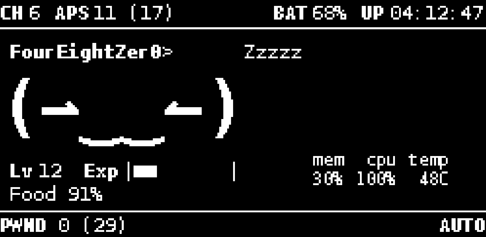
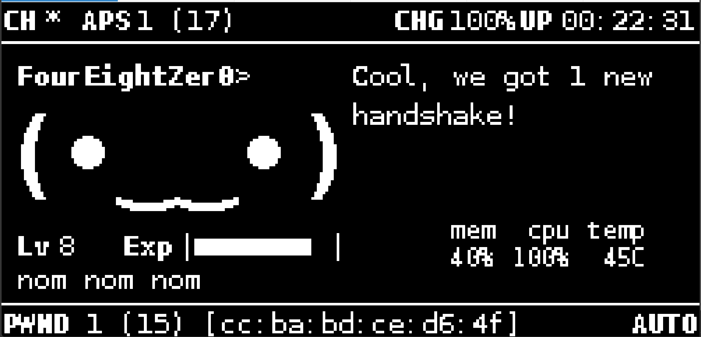
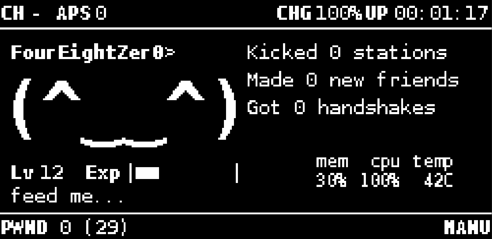

This plugin is designed to work with jayofelony Pwnagotchi 2.9.5.4

# Nomagotchi

A Pwnagotchi plugin that adds a hunger bar and feeds it when handshakes are captured.

## Features

- Hunger value from `0` to `max_hunger`
- Hunger decays over time
- Each captured handshake increases hunger
- Small UI bar shown on screen
- State persistence across reboots

## Install

1. Copy `nomagotchi.py` to your Pwnagotchi custom plugins directory:

   - Typical path: `/usr/local/share/pwnagotchi/custom-plugins/nomagotchi.py`

2. Enable and configure the plugin in your `config.toml`:

```toml
[main.plugins.nomagotchi]
enabled = true
max_hunger = 100
start_hunger = 70
handshake_reward = 20
decay_interval_sec = 300
decay_amount = 1
warn_threshold = 25
feed_text = "nom nom nom"
feed_text_duration_sec = 6
hungry_text = "im hungry..."
hungry_texts = ["im hungry...", "i need food...", "feed me..."]
hungry_text_rotation_sec = 8
persist_file = "/root/.pwnagotchi/nomagotchi_state.json"
ui_position = [5, 93]
```

3. Restart Pwnagotchi.

## Options

- `max_hunger`: Maximum hunger meter value
- `start_hunger`: Initial hunger if no state file exists
- `handshake_reward`: Hunger added per handshake capture
- `decay_interval_sec`: How often hunger decays
- `decay_amount`: Hunger decrease per decay tick
- `warn_threshold`: Warning log threshold
- `feed_text`: Text shown briefly when a handshake feeds Nomagotchi
- `feed_text_duration_sec`: How long to show `feed_text`
- `hungry_text`: Text shown when hunger is at or below `warn_threshold`
- `hungry_texts`: List of rotating low-hunger phrases (overrides single `hungry_text` if provided)
- `hungry_text_rotation_sec`: Seconds before switching to another hungry phrase
- `persist_file`: JSON state file location
- `ui_position`: Screen coordinates for the element

## Behavior

- On handshake event, hunger increases and state is saved.
- On epoch events, hunger decays by `decay_amount` every `decay_interval_sec` seconds.
- UI updates continuously with feed text, low-hunger rotating text, or the bar and percentage.

## Notes

- This plugin uses the plugin callback `on_handshake`, so feeding is based on successful handshake captures.
- If you already use the same UI position with another plugin, change `ui_position` to avoid overlap.
